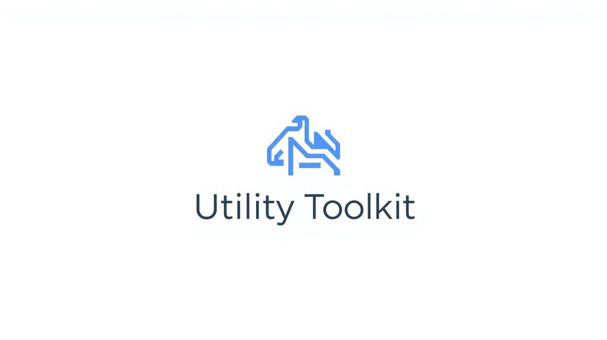
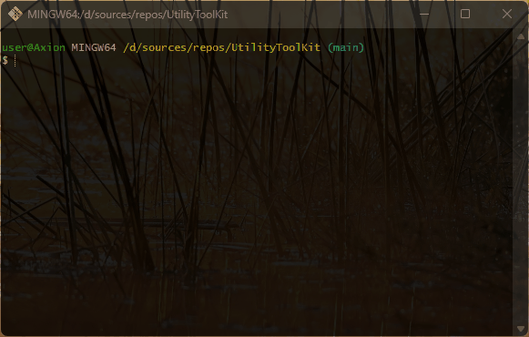

# UtilityToolKit
Contains components that can be used in projects. Accessed through helpers and extensions

## 💻 About program
*Sections:*

*String Helper*
- *Checking string palindrome*
- *Reverse text*
- *Count of words*

*Math Utilities*
- *Check even number*
- *Check odd number*
- *Calculate factorial*
- *Calculate degree of number*

*Pagination Extension*
- *Get numbers on page*

### 🪟 Preview

### ⚙️ Technologies
 

## 🧑‍💻 I worked on it
- *OOP princples: Abstraction, Encapsulation, Inheritance, Polymorphism*
- *Elements of OOP: classes, objects*
- *Classes: Console, ConsoleKey, ConsoleKeyInfo,  Random, Enumerable, user-defined classes*
- *Data types: int, string*
- *Access modifiers: public, private*
- *LINQ methods: Reverse(), Count(), Equals(), Repeat(), Range(), Aggregate(), GroupBy(), Skip() & Take()*
- *Strings: Regular, Interpolation*
- *Looping statements: for, do while, while*
- *Condition statements: if else, switch, ternary operator*
- *Keywords: break, this*